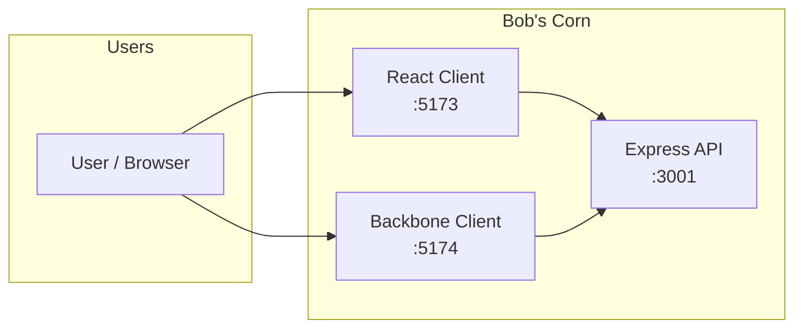
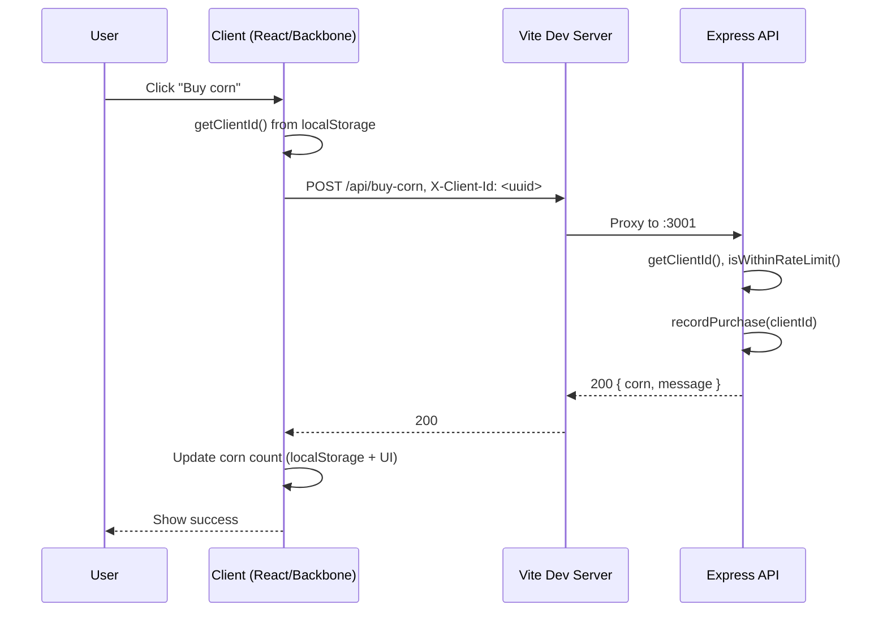
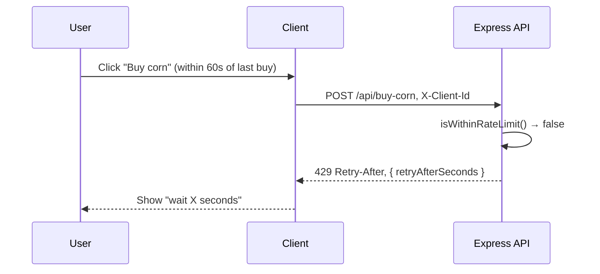
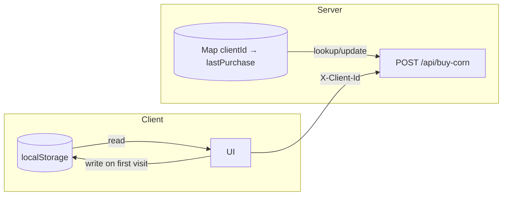

# High Level Design (HLD) — Bob's Corn

## 1. Purpose

This document describes the high-level architecture of **Bob's Corn**: a rate-limited corn-purchasing API and optional web clients. The system enforces **at most 1 corn per client per minute** (sliding 60-second window).

---

## 2. System Context



- **Actors:** End users via browser.
- **System:** One backend API; one or two optional frontends (React, Backbone). Clients are interchangeable from the API’s perspective.
- **External:** No external services; in-memory state only.

---

## 3. Architecture Overview

| Layer        | Component        | Tech              | Responsibility                          |
|-------------|-------------------|-------------------|-----------------------------------------|
| **Backend** | Express API       | Node.js, Express  | Rate limiting, buy-corn, health check   |
| **Frontend**| React client      | React, Vite, Tailwind | UI + hooks + API calls (port 5173)  |
| **Frontend**| Backbone client   | Backbone, Vite, Tailwind | UI + models + API calls (port 5174) |

**Communication:** Clients call the API over HTTP. In development, Vite proxies `/api` to `http://localhost:3001`, so the browser sends requests to the same origin and the dev server forwards them to Express.

---

## 4. Component Design

### 4.1 Backend (Server)

```
┌─────────────────────────────────────────────────────────┐
│  Express App (server/index.js)                          │
├─────────────────────────────────────────────────────────┤
│  Middleware: CORS (origin: true), express.json()        │
│  State: clientLastPurchase Map<clientId, timestamp>      │
│  Constants: RATE_LIMIT_MS = 60_000                      │
├─────────────────────────────────────────────────────────┤
│  Routes:                                                 │
│    POST /api/buy-corn  → rate check → 200 | 429         │
│    GET  /api/health    → { status, farm }               │
└─────────────────────────────────────────────────────────┘
```

- **Client identification:** `X-Client-Id` header if present; else `req.ip`; else `'anonymous'`.
- **Rate limit:** Sliding window: allow only if `now - lastPurchase >= 60s` for that client.
- **On 429:** Response includes `Retry-After` header and `retryAfterSeconds` in JSON.

No persistence: rate-limit state and “corn count” are not stored on the server. Corn count is a client-side concept (e.g. localStorage).

### 4.2 Frontend (Clients)

Both clients provide:

- **Client ID:** Generate UUID once, store in `localStorage` under `bobs-corn-client-id`, send on every `POST /api/buy-corn` via `X-Client-Id`.
- **Corn count:** Persist in `localStorage`; increment on successful purchase.
- **Buy flow:** Call `POST /api/buy-corn`; handle 200 (success) and 429 (show retry-after); surface errors otherwise.

**React:** Components (presentation) + hooks (state/side effects) + `api.ts` (HTTP).  
**Backbone:** Views + models (e.g. CornBasketModel, BuyStateModel) + `api.js` (HTTP).

---

## 5. Data Flow

### 5.1 Buy Corn (success within limit)



### 5.2 Buy Corn (rate limited)



### 5.3 Client ID and rate-limit state



- **Client:** One UUID per browser (localStorage). Same browser ⇒ same client for rate limiting.
- **Server:** One entry per client ID; value = timestamp of last successful purchase. No TTL; map can grow. Acceptable for a single-instance, demo-style service.

---

## 6. Key Design Decisions

| Decision | Rationale |
|----------|------------|
| **Client ID in header** | Keeps rate limit tied to “identity” chosen by the client (e.g. one per browser). IP fallback for non-browser or missing header. |
| **Sliding 60s window** | Simple and matches “1 corn per minute” literally: each purchase blocks the next for 60s from that purchase. |
| **In-memory rate limit** | No DB required; suitable for single instance. Rate limit resets on server restart. |
| **Corn count only on client** | Server is stateless for “how many corns”; clients own count and persistence (localStorage). |
| **Vite proxy in dev** | Same-origin requests from the app; avoids CORS issues and keeps client config simple (e.g. `/api`). |
| **Two frontends** | Same API contract; allows comparing React vs Backbone implementation. |

---

## 7. Deployment View

- **Development:** Run `server` (e.g. `npm run dev` in `server/`) and one or both clients (Vite dev servers). API must be reachable at the proxy target (e.g. `http://localhost:3001`).
- **Production (conceptual):** Serve API on a host/port (e.g. Node process behind reverse proxy). Serve React or Backbone as static assets (e.g. `npm run build` + static hosting). Configure API base URL / proxy so `/api` or an absolute URL points to the API. Single API instance ⇒ in-memory rate limit is consistent; multiple instances would require a shared store (out of scope for this HLD).

---

## 8. Out of Scope / Future

- Persistence of rate-limit or purchase history.
- Authentication/authorization.
- Distributed rate limiting (multi-instance).
- Server-side corn balance or inventory.
